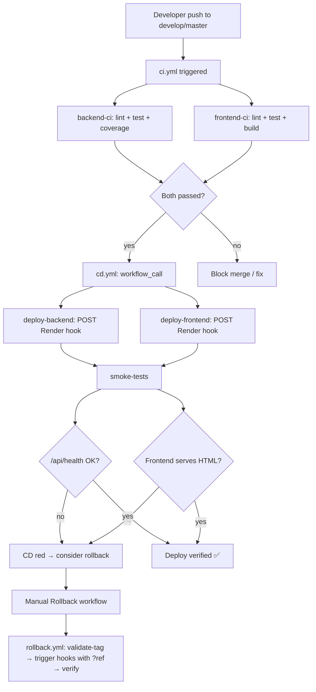

# MovieMapUA — CI/CD процес

---

## Зміст

1. [Огляд](#огляд)
2. [Branching і середовища](#branching-і-середовища)
3. [Flow діаграма](#flow-діаграма)
4. [Деталі workflow-ів](#деталі-workflow-ів)
5. [SemVer policy](#semver-policy)
6. [Як зробити реліз](#як-зробити-реліз)
7. [Secrets та env vars](#secrets-та-env-vars)
8. [Known issues](#known-issues)

---

## Огляд

CI/CD MovieMapUA побудований на **GitHub Actions** + **Render** (PaaS для backend/frontend) + **MongoDB Atlas** (managed DB).

Три workflow-и в `.github/workflows/`:

| Workflow | Trigger | Що робить |
|----------|---------|-----------|
| `ci.yml` | `push` / `pull_request` → master, develop | Лінт, тести, build обох проєктів. На push кличе `cd.yml` |
| `cd.yml` | `workflow_call` з ci.yml | Тригер Render deploy hooks → smoke tests |
| `rollback.yml` | `workflow_dispatch` (manual) | Rollback на вказаний тег з smoke verification |

---

## Branching і середовища

```
develop  ─── push ───►  CI ──► CD ──► Render staging
master   ─── push ───►  CI ──► CD ──► Render production
```

| Branch | Render service (backend) | Render service (frontend) |
|--------|--------------------------|---------------------------|
| `develop` | gilsgang-team-project-staging-server.onrender.com | gilsgang-team-project-staging-client.onrender.com |
| `master` | gilsgang-team-project.onrender.com | gilsgang-team-project-1.onrender.com |

PR flow: `feature/*` → PR в `develop` → merge → staging deploy → manual QA → PR з develop в master → production deploy.

---

## Flow діаграма



---

## Деталі workflow-ів

### `ci.yml`

Два паралельні jobs: `backend-ci` і `frontend-ci`. Кожен:
1. Checkout
2. Setup Node 22 + npm cache
3. `npm ci`
4. `npm run lint --if-present || true` (warnings не блокують)
5. `npm run test:coverage --if-present`
6. (frontend) `CI=false npm run build`
7. Upload coverage artifact

Третій job `run-cd-pipeline`:
- Needs: обидва CI
- Якщо event == push → `uses: ./.github/workflows/cd.yml` (через `workflow_call`).

### `cd.yml`

Тригер: тільки через `workflow_call` з ci.yml.

Jobs:
1. **deploy-backend** — `curl -X POST` на Render webhook (production або staging залежно від гілки).
2. **deploy-frontend** — те саме для frontend.
3. **smoke-tests** (`needs` обох вище):
   - Resolve target environment.
   - Polling `/api/health` до 30 спроб × 15s (≈ 7.5 хв). Чекаємо `status: "ok"`.
   - Polling frontend до 20 × 15s (≈ 5 хв). Чекаємо HTTP 200 + `id="root"` у HTML.

### `rollback.yml`

Manual trigger. Inputs:
- `tag` — наприклад `v1.0.0`
- `environment` — staging / production
- `target` — backend / frontend / both

Jobs:
1. **validate-tag** — `git rev-parse refs/tags/<tag>`. Fail якщо тег не існує.
2. **rollback-backend** / **rollback-frontend** — Render hook з query-параметром `?ref=<sha>`.
3. **verify-rollback** — smoke verification + GitHub step summary.

Детальніше у [ROLLBACK.md](ROLLBACK.md).

---

## SemVer policy

Версії в `MovieMapUA-main/api/coursework_back/package.json` і теги в git слідують **Semantic Versioning 2.0**:

```
v MAJOR . MINOR . PATCH
  │       │       │
  │       │       └── backward-compatible bug fixes
  │       └────────── backward-compatible нова функціональність
  └──────────────────── breaking changes (схема API, формат БД, видалені endpoints)
```

**Приклади:**
- Виправили баг у `/api/movie` без зміни API → `1.1.0` → `1.1.1`
- Додали новий endpoint `/api/health` → `1.0.0` → `1.1.0` (поточний)
- Прибрали поле з response `/api/user/:id` → `1.1.0` → `2.0.0`

Beck версії package.json теж бажано тримати в синку з тегами (фронтенду це менш критично, бо там SemVer для бібліотек, а не для додатку як такого).

---

## Як зробити реліз

```bash
# 1. Усе протестовано на staging (develop merged), QA пройдено
git checkout master
git pull
git merge --no-ff develop -m "chore(release): prepare v1.2.0"

# 2. Підняти версію (по SemVer)
# редагуй MovieMapUA-main/api/coursework_back/package.json → "version": "1.2.0"
git add MovieMapUA-main/api/coursework_back/package.json
git commit -m "chore(release): bump version to 1.2.0"

# 3. Тег + push
git tag -a v1.2.0 -m "Release 1.2.0: <короткий опис змін>"
git push origin master
git push origin v1.2.0

# 4. Спостерігаєш CI → CD → smoke tests у GitHub Actions
```

Після релізу — створи GitHub Release (Repository → Releases → Draft a new release → обери тег) з changelog.

---

## Secrets та env vars

### GitHub Actions secrets (Repository → Settings → Secrets → Actions)

| Secret | Призначення |
|--------|-------------|
| `RENDER_BACKEND_PRODUCTION_HOOK` | Render deploy hook URL для backend prod |
| `RENDER_BACKEND_STAGING_HOOK` | Render deploy hook URL для backend staging |
| `RENDER_FRONTEND_PRODUCTION_HOOK` | Render deploy hook URL для frontend prod |
| `RENDER_FRONTEND_STAGING_HOOK` | Render deploy hook URL для frontend staging |

Уже налаштовано одногрупниками. URLs беруться у Render: Service → Settings → Deploy Hook.

### Render env vars (Service → Environment)

**Backend (обидва середовища):**
| Variable | Приклад |
|----------|---------|
| `MONGO_URL` | `mongodb+srv://...atlas...` |
| `JWT` | random secret string |
| `PORT` | `5000` (Render підставляє автоматично) |
| `SENTRY_DSN` | `https://abc@o123.ingest.sentry.io/456` |
| `NODE_ENV` | `production` або `staging` |

**Frontend (обидва середовища):**
| Variable | Приклад |
|----------|---------|
| `REACT_APP_SENTRY_DSN` | `https://abc@o123.ingest.sentry.io/789` |
| `REACT_APP_ENV` | `production` або `staging` |
| `REACT_APP_VERSION` | `1.1.0` (опційно) |

Деталі про Sentry → [MONITORING.md](MONITORING.md#sentry--error-tracking).

---

## Known issues

### 🐛 `cd.yml` завжди деплоїть на staging

**Симптом:** Push у `master` тригерить CD, але всі деплої йдуть на staging-сервіс.

**Причина:** У `cd.yml:15` і `cd.yml:28` умова — `github.event.workflow_run.head_branch`. Це поле існує тільки в `workflow_run` event'і. Оскільки `cd.yml` викликається через `workflow_call` (з `ci.yml`), `github.event` — це той самий push event, що тригернув ci.yml. Поля `workflow_run.head_branch` там немає → `${{ ... }}` резолвиться у порожній рядок → `[ "" = "master" ]` завжди false → else-гілка → staging.

**Фікс:** Передавати branch через `workflow_call inputs` з `ci.yml` у `cd.yml`. Приклад:

```yaml
# ci.yml
  run-cd-pipeline:
    needs: [backend-ci, frontend-ci]
    if: github.event_name == 'push'
    uses: ./.github/workflows/cd.yml
    secrets: inherit
    with:
      branch: ${{ github.ref_name }}
```

```yaml
# cd.yml
on:
  workflow_call:
    inputs:
      branch:
        type: string
        required: true

jobs:
  deploy-backend:
    steps:
      - run: |
          if [ "${{ inputs.branch }}" = "master" ]; then
            curl -X POST ${{ secrets.RENDER_BACKEND_PRODUCTION_HOOK }}
          else
            curl -X POST ${{ secrets.RENDER_BACKEND_STAGING_HOOK }}
          fi
```

Аналогічно для frontend і smoke-tests jobs.

**Чому не виправлено в цій ітерації:** код CD підтримувався іншими членами команди, фікс потребує узгодження. Smoke tests у моїй гілці навмисно mirror'ять той самий broken check, щоб поведінка була consistent. Після фіксу — оновити і smoke (`cd.yml`), і rollback (вже використовує `inputs.environment`, тому з ним усе ОК).
